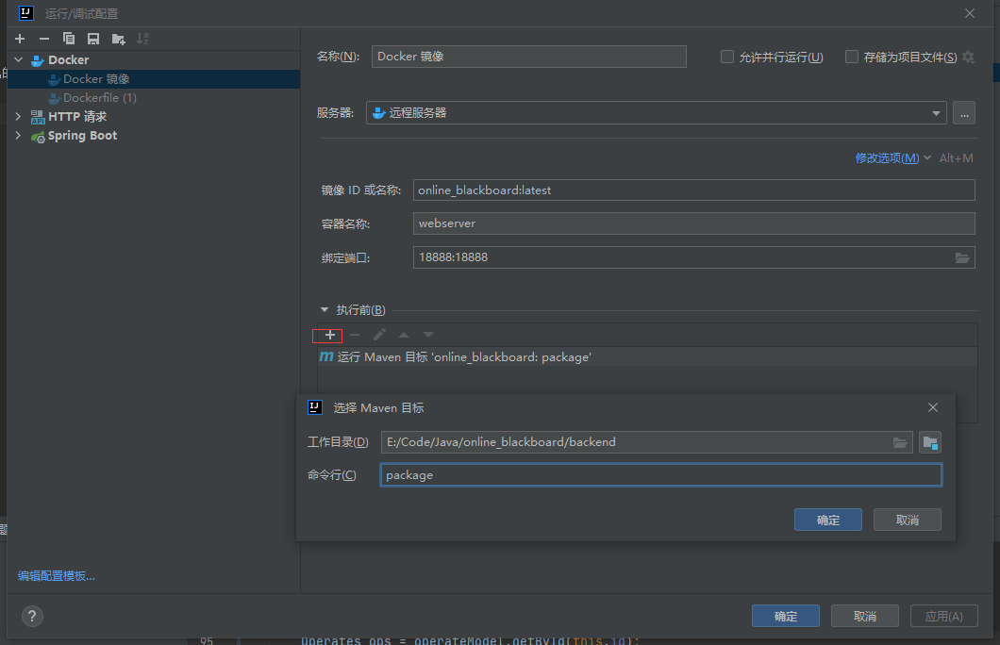

# 在线白板后台程序

项目启动需要安装redis,ribbitmq,mysql8.0

项目克隆下来后将redis,ribbitmq,mysql地址修改为自己的地址,如果有docker可以将pom.xml的dockerHost项
地址修改为自己的然后配置idea点击运行即可自动部署

如果没有docker则需要用maven打包

打包后的文件执行

``
java -jar 打包后的文件名
``

即可以部署项目